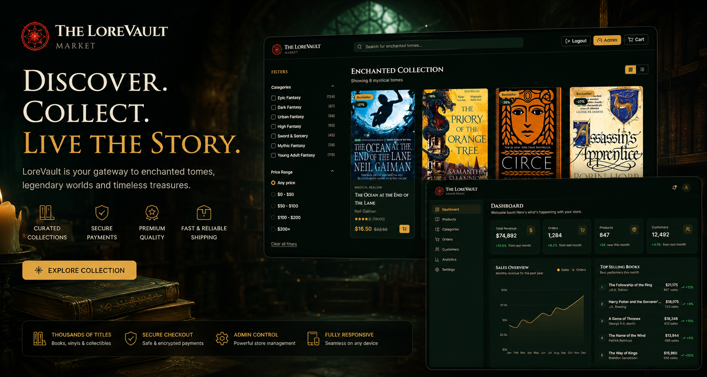
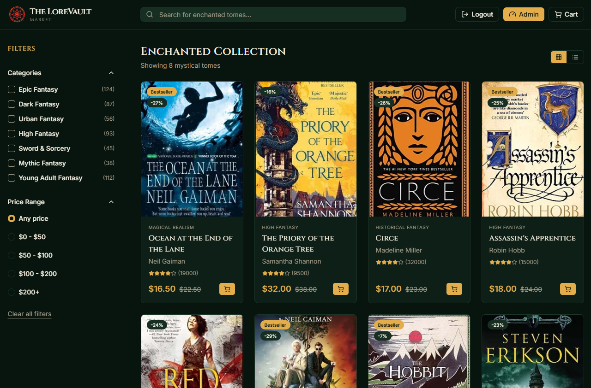
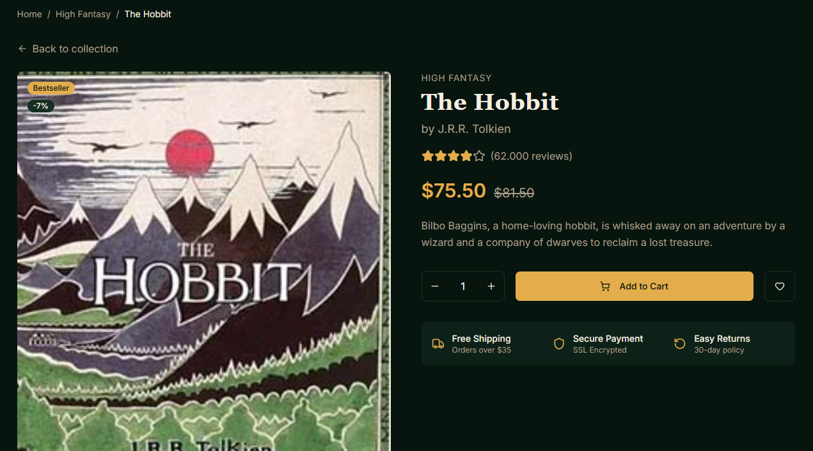
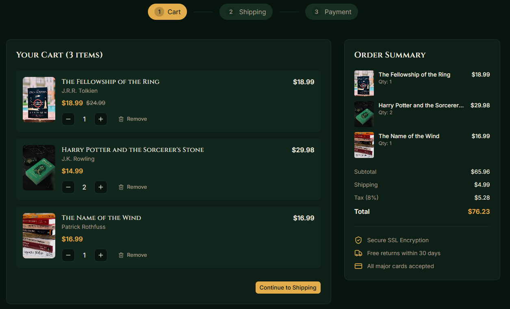
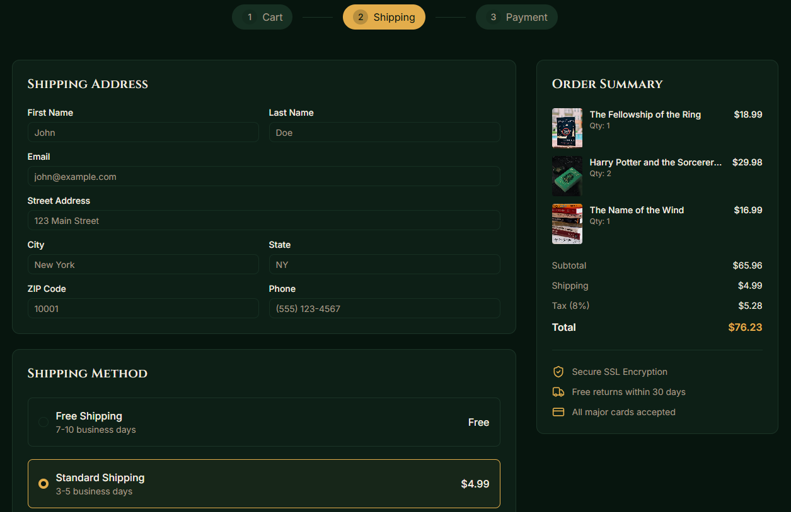
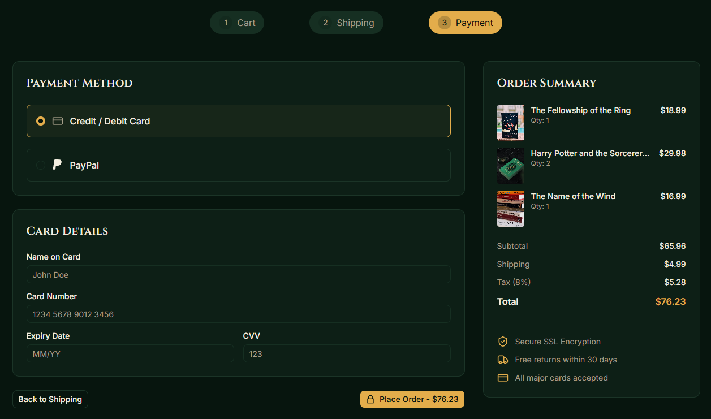
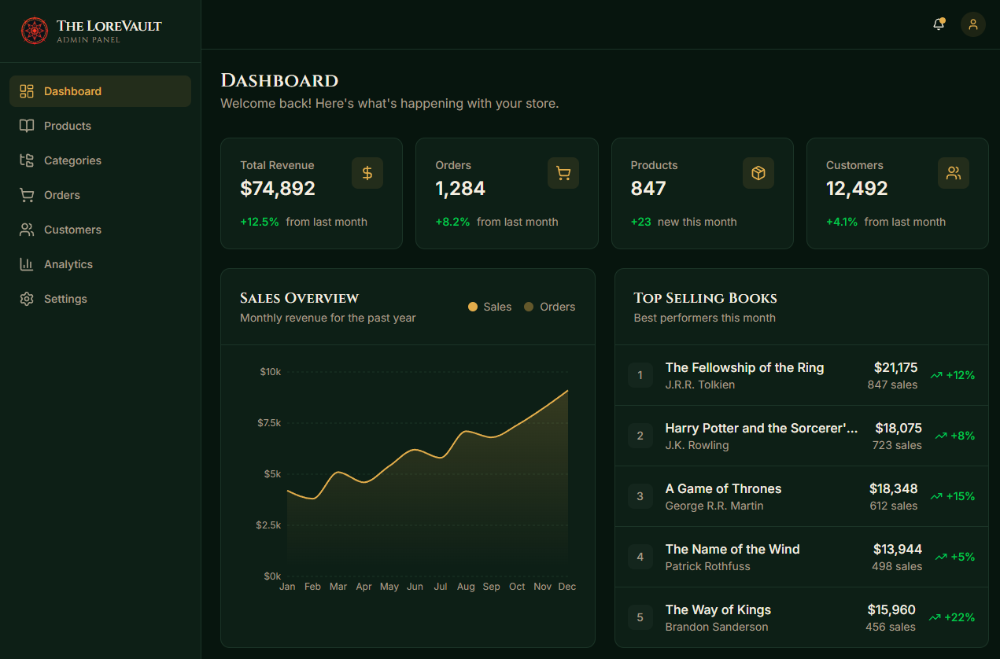
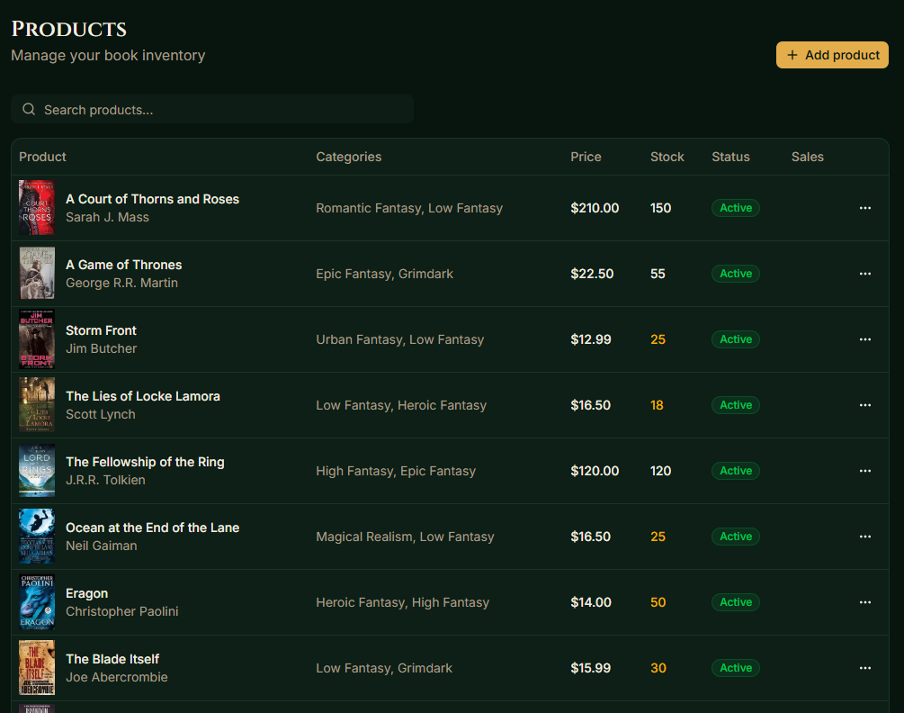
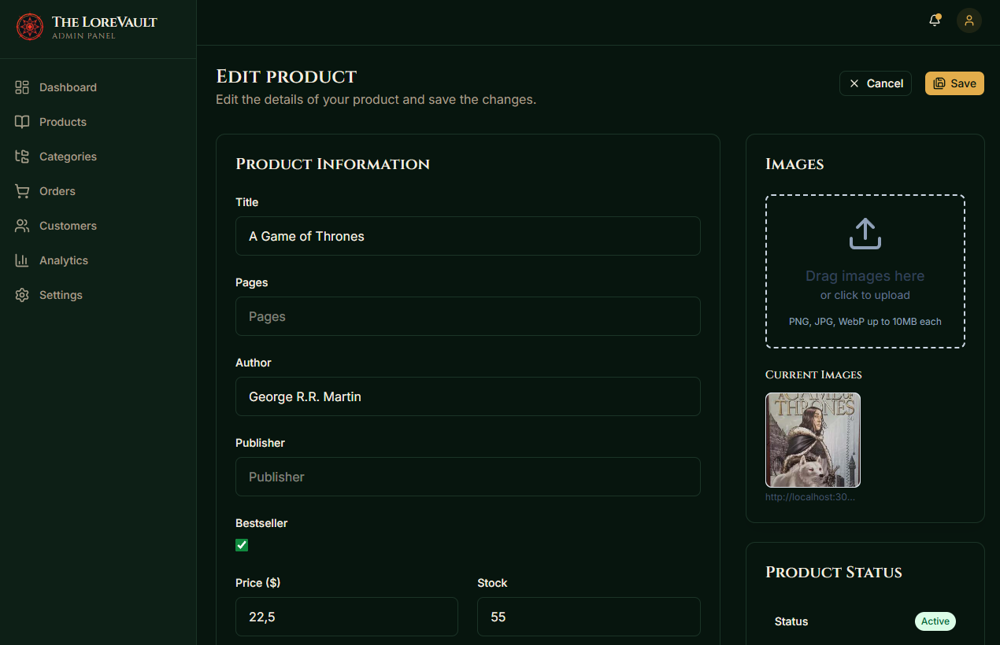

# LoreVault Frontend


Modern fantasy-themed fullstack marketplace built with React, NestJS and PostgreSQL. Featuring authentication, admin dashboard and product management.



---

## Highlights

- Fullstack marketplace architecture using React + NestJS
- JWT authentication with role-based admin access
- Fantasy-themed custom UI inspired by RPG marketplaces
- Responsive checkout and admin dashboard
- PostgreSQL + TypeORM relational backend
- Dockerized backend environment

---

## Live Demo

🔗 [Live Demo](https://lore-vault-market.netlify.app/)

---

## Demo Admin Account

```txt
email: admin@lorevault.com
password: Abc123
```

> Demo mode is enabled. Some destructive actions may be restricted.

---

## Screenshots

### Home Page



---

### Product Details



---

### Shopping Cart, Shipping and Payment







---

### Admin Dashboard



---

### Product Management





---

## Features

* JWT Authentication
* Role-based admin dashboard
* Product CRUD
* Shopping cart
* Responsive UI
* Product search and filtering
* Category system
* Modern UI with Tailwind CSS
* Fullstack architecture

## Roadmap

- Checkout flow UI
- Payment integration
- Order processing

---

## Architecture

Frontend (React + Vite) communicates with a REST API built using NestJS.  
Authentication is handled with JWT tokens and data is persisted in PostgreSQL hosted on Neon.

Netlify → Render → Neon

---

## Tech Stack

### Frontend

* React
* TypeScript
* Vite
* Tailwind CSS
* React Router
* Axios
* Shadcn/UI

### Backend

* NestJS
* PostgreSQL
* TypeORM
* JWT Authentication
* Docker

---

## Infrastructure

Frontend deployed on Netlify  
Backend API deployed on Render  
Database hosted on Neon

---

## Installation

```bash
npm install
```

---

## Environment Variables

Create a `.env` file:

```env
VITE_API_URL=http://localhost:3000
```

---

## Run Locally

```bash
npm run dev
```

---

## Backend Repository

🔗 [https://github.com/tomgimenez/e-commerce-backend](https://github.com/tomgimenez/e-commerce-backend)

---

## Frontend Repository

🔗 [https://github.com/tomgimenez/e-commerce-frontend](https://github.com/tomgimenez/e-commerce-frontend)

---

## Future Improvements

* Payments integration
* Wishlist system
* Product reviews
* Order history
* CI/CD pipeline
* Image optimization
* Unit and E2E testing

---

## Author

Developed by Tomas Gimenez.
